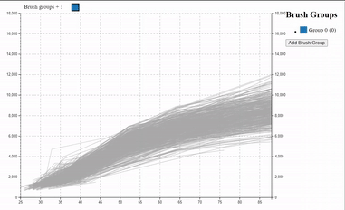
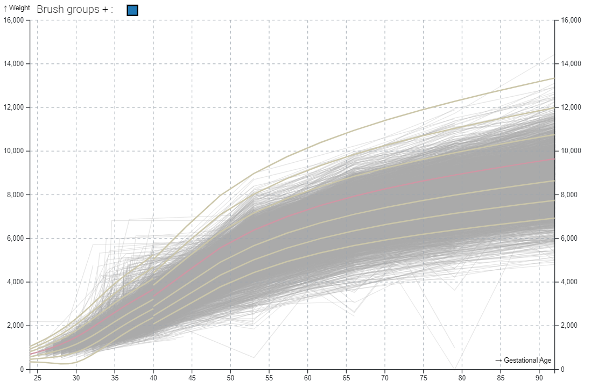

<h1 align="center">
  <br>
  TimeSearcher+
  <br>
</h1>
<h4 align="center">A tool that summarizes and explores temporal data sets with quantitative values</h4>
You can use it to visualize thousands of time series, and select multiple groups by direct manipulation. In addition, it
works as a reactive widget that can be added to other applications, returning the selected groups in real time.

| Group Selection                                   | Detailed View                                   | Reference Lines                                    |
|---------------------------------------------------|-------------------------------------------------|----------------------------------------------------|
|  |  |  |

## Try it!

You can test timeSearcher+ right now with your **own CSV data** (less than 200MB), using:
| Obervable Notebook |
| --- |
|TODO GIF and noteBook |

## Install

```js
npm install time-searcher-plus
```
Requires [^popper.js@2.11.6](https://github.com/FezVrasta/popper.js/), [^d3@7.8.2](http://d3js.org) and [^htl@0.3.1](https://github.com/observablehq/htl).

```html
<!DOCTYPE html>
<html lang="en">
<head>
  <meta charset="UTF-8">
  <meta name="viewport" content="width=device-width, initial-scale=1.0">
  <title>Document</title>
</head>
<body>
  <!-- target for the main Widget -->
  <div id="target"></div>
  <!-- target fot the detailed Widget -->
  <div id="targetDetailed"></div>

  <!-- Load the libraries -->
  <script src="https://d3js.org/d3.v7.js"></script>
  <script src="https://unpkg.com/@popperjs/core@2"></script>
  <script src="https://unpkg.com/htl@0.3.1/dist/htl.min.js"></script>
  <script src="https://unpkg.com/time_searcher/dist/TimeSearcher.min.js"></script>

  <script >
    // TimeSearcher+ Step 1. Create a TimeSearcher+ passing a series of arguments.
    let target = TimeSearcher({
      target: d3.select("#target").node(), // Target to render the overview Widget
      detailedElement: d3.select("#targetDetailed").node(), // Target to render the detailed Widget (Optional)
      x: "Date", // Atribute to show in the X axis (Note that it also supports functions)
      y:  "Open", // Atribute to show in the Y axis (Note that it also supports functions)
      id: "stock", // / Atribute to group the input data (Note that it also supports functions)
      updateCallback: (data) => {console.log(data)}, // Set a callback that will be called when the user's selection is changed. (Optional)

    })
    

    // load your data, Remember to provide a function that transforms your data attributes to the correct type.
    d3.csv("./sp500_20-22.csv",type).then(data => {
      target.ts.data(data);
    });
```
### Step by step

1. **HTML**. Start with this template
```html
<!DOCTYPE html>
<html lang="en">
<head>
  <meta charset="UTF-8">
  <meta name="viewport" content="width=device-width, initial-scale=1.0">
  <title>Document</title>
</head>
<body>
  <!-- Your overview widget goes here -->
  <div id="target"></div>
  <!-- tYour detailed widget goes here -->
  <div id="targetDetailed"></div>
</body>
</html>
```
2. **Import TimeSearcher+**. Create and import a new JavaScript file below the scripts (d3, Popper and TimeSearcher+)
or right in the html like in the example below.
```html
<script src="https://d3js.org/d3.v7.js"></script>
<script src="https://unpkg.com/@popperjs/core@2"></script>
<script src="https://unpkg.com/htl@0.3.1/dist/htl.min.js"></script>
<script src="https://unpkg.com/time_searcher/dist/TimeSearcher.min.js"></script>
<script type="text/javascript">
  //   YOUR_JS_CODE_HERE
</script>
```
3. **Create a TimeSearcher+ Instance**
```js
   let target = TimeSearcher({
      target: d3.select("#target").node(), // Target to render the overview Widget
      detailedElement: d3.select("#targetDetailed").node(), // Target to render the detailed Widget (Optional)
      x: "Date", // Atribute to show in the X axis (Note that it also supports functions)
      y:  "Open", // Atribute to show in the Y axis (Note that it also supports functions)
      id: "stock", // / Atribute to group the input data (Note that it also supports functions)
      // More configuration parameters
      overviewWidth: 1200, // Set the desired width of the overview Widget
      detailedWidth: 1200 - 20, // Set the desired width of the detailed Widget
      overviewHeight: 600, // Set the desired height of the overview Widget
      detailedHeight: 300, // Set the desired height of the individual detailed graph Widget
      detailedContainerHeight: 400, // Set the desired height of the detailed Widget
      updateCallback: (data) => {console.log(data)}, // Set a callback that will be called when the user's selection is changed.
      statusCallback: (status) => {}, // Set a callback that will be called when changing the internal state of the widget ( assignment of colors, brushes, etc...)
      fmtX: d3.timeFormat("%d/%m/%y"), // Function, how to format x points in the tooltip
      fmtY: d3.format(".2d"), // Function, how to format x points in the tooltip
      yLabel: "",
      xLabel: "",
      filters: [], // Array of filters to use, format [[x1, y1], [x2, y2], ...]
      brushShadow: "drop-shadow( 2px 2px 2px rgba(0, 0, 0, .7))", // How to show a shadow on the selected brush
      maxDetailedRecords: 100, // How many results to show in the detail view
   })
```

4. [Optional] **Configure TimeSearcher render**
```js
   // Default Parameters
   target.ts.xPartitions = 10; // Partitions performed on the X-axis for the collision acceleration algorithm.
   target.ts.yPartitions = 10; // Partitions performed on the Y-axis for the collision acceleration algorithm.
   target.ts.defaultAlpha = 0.8; // Default transparency (when no selection is active) of drawn lines
   target.ts.selectedAlpha = 1; // Transparency of selected lines
   target.ts.noSelectedAlpha = 0.4; // Transparency of unselected lines
   target.ts.backgroundColor = "#ffffff";
   target.ts.defaultColor = "#aaa"; // Default color (when no selection is active) of the drawn lines. It only has effect when "groupAttr" is not defined.
   target.ts.selectedColor = "#aaa"; // Color of selected lines. It only has effect when "groupAttr" is not defined.
   target.ts.noSelectedColor = "#ddd"; // Color of unselected lines. It only has effect when "groupAttr" is not defined.
   target.ts.hasDetailed = true; // Determines whether detail data will be displayed or not. Disabling it saves preprocessing time if detail data is not to be displayed.
   target.ts.margin = { left: 50, top: 30, bottom: 50, right: 20 };
   target.ts.colorScale = d3.scaleOrdinal(d3.schemeCategory10); // The color scale to be used to display the different groups defined by the "groupAttr" attribute.
   target.ts.brushesColorScale = d3.scaleOrdinal(d3.schemeCategory10); // The color scale to be used to display the brushes
   target.ts.groupAttr = null; // Specifies the attribute to be used to discriminate the groups.
   target.ts.doubleYlegend = false; // Allows the y-axis legend to be displayed on both sides of the chart.
   target.ts.showGrid = false; // If active, a reference grid is displayed.
   target.ts.showBrushTooltip = true; // Allows to display a tooltip on the brushes containing its coordinates.
   target.ts.autoUpdate = true; // Allows to decide whether changes in brushes are processed while moving, or only at the end of the movement.
   target.ts.brushGruopSize = 15; //Controls the size of the colored rectangles used to select the different brushGroups.
   target.ts.stepX = { days: 10 }; // Defines the step used, both in the spinboxes and with the arrows on the X axis. (See https://date-fns.org/v2.16.1/docs/Duration )
   target.ts.stepY = 1; // // Defines the step used, both in the spinboxes and with the arrows on the Y axis.
```
5. **Set the data**
```js
   target.ts.data(myData);
```
6. **[Optional] Add the references lines
```js
    target.ts.addReferenceCurves(myReferenceCurves)
 ```
The file containing the reference lines will be a json file with the following definition:
```js
[
  {
    "name": "Line1",
    "color": "yellow", // Color in css format
    "opacity": 1, // opacity level of the line
    "data": [[p1x,p1y],[p2x,p2y]...]
  },
  {
    "name": "Line2",
    "color": "red", // Color in css format
    "opacity": 0.5, // opacity level of the line
    "data": [[p1x,p1y],[p2x,p2y]...]
  }
]  
 ```


## License

TimeSearcher+.js is licensed under the MIT license. (http://opensource.org/licenses/MIT)


